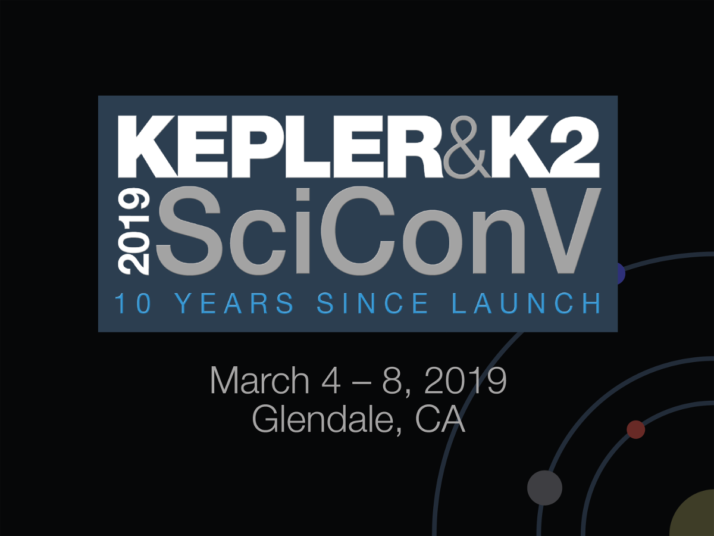

Title: Kepler SciCon V registration and late poster deadline approaching
Date: 2019-01-30 10:00
Author: Geert Barentsen

The <a href='scicon-2019/index.html'>Kepler & K2 Science Conference V</a>
will take place March 4-8, 2019, in Glendale, California.
The meeting will be a celebration of Kepler's 10 years in space
and will serve as a showcase of the bountiful results that continue to come
from both the Kepler and K2 missions.

Due to the government shutdown, **the late deadline to submit abstracts for posters has been moved to Tuesday, February 5, 2019.**
Abstracts can be submitted through the
[abstract submission form](https://catcopy.ipac.caltech.edu/ksc2019/abstract.php). Participants may submit multiple abstracts.

**The deadline to register for the meeting and to reserve hotel rooms is Sunday, February 10, 2019.**

Additional details, including information about travel and lodging,
are available on the [conference home page](/scicon-2019/).
If you have questions regarding the conference, please send an email to <a href="mailto:keplerscicon@ipac.caltech.edu">keplerscicon@ipac.caltech.edu</a>.

