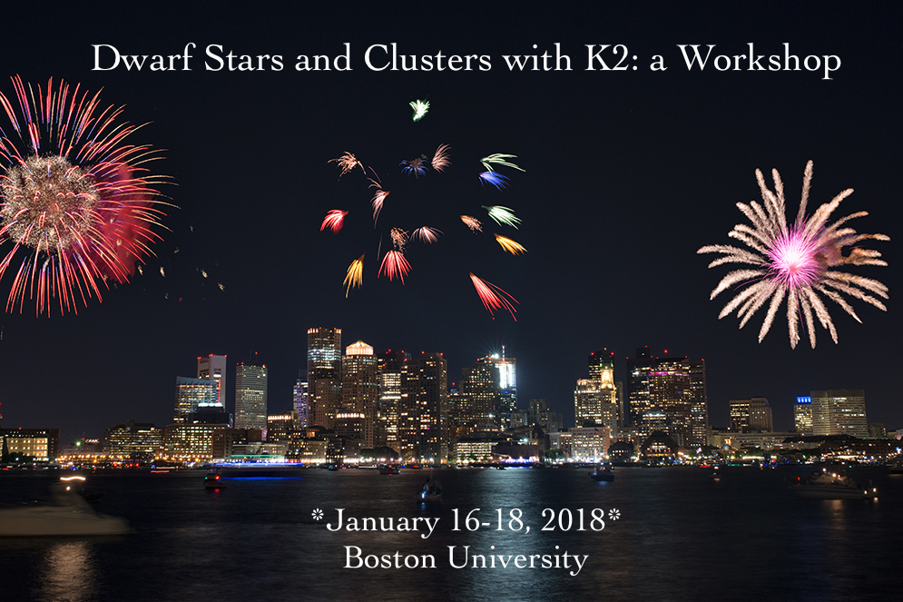

Title:
Save_as: cluster-workshop/index.html

[TOC]

 
*Image Credit: Eric Kilby*

## Summary

The K2 Mission and Boston University will host a **Dwarf Stars and Clusters Workshop on Jan 16-18, 2018**,
at BU in Boston, Massachusetts.

Since its launch in 2009, the Kepler telescope has been providing high precision photometric time series on thousands of
targets, from exoplanet hosts to active dwarf stars. With its focus on the ecliptic plane, the K2 Mission has further
expanded science opportunities, especially in the area of stellar clusters and magnetic activity. By the end of 2017, K2
will have observed more than 15 open clusters and associations, some on more than one occasion. The resulting data have
enabled ground-breaking research on a number of topics, including gyrochronology, stellar rotation and activity, planet
occurrence rates, young stellar objects, and eclipsing binary systems. Astronomers working in these areas are warmly
invited to gather for discussion at BU this coming January.

The motivations for this workshop include:

* Summarizing the science done to date with K2 in the area of cool stars, star formation regions, and open clusters
* Forging new collaborations for future science with K2
* Exploring synergies with other space missions (especially TESS), wavelength regions, and science areas.

### Agenda

This will be a small workshop with time for most participants to give a short overview of their research during the first
two days. (There will not be any posters.) We have reserved the final morning for "hack day" activities, including data how-to's
and high-level science product creation overviews. We will also encourage participants to spend time comparing technical
approaches to K2 data, including photometry.

<h4 style="font-weight: bold;">Schedule TBA</h4>

### Venue

The workshop will take place on the Boston University campus, primarily at the College of Arts and Sciences.

The nearest airport is the Boston Logan International Airport.
We recommend using the MBTA system, which provides public transportation from the airport.

### Accommodation

There is no on-site accommodation available for this meeting, but we can recommend the following nearby hotels:

* <a href='https://cambridge.regency.hyatt.com/en/hotel/home.html'>The Hyatt Regency Cambridge</a> is just across
the river and walkable (at most 15 minutes) and has rooms for approximately $150-200/night + tax.

* <a href='http://www.bostonhotelbuckminster.com/'> Hotel Buckminster</a> is on the BU side of the river, in Kenmore Square.
Prices range from $110-150/night + tax.

* <a href='https://www.hotelcommonwealth.com/'> Hotel Commonwealth</a> is also in Kenmore Square, but a bit more pricey.

* Students on a budget may want to check out the <a href='http://bostonhostel.org/'>hostel</a> in central Boston. 

* For other options, check out hotels on the B or C Green Lines, such as the <a href='https://www.reservations.com/hotel/holiday-inn-boston-brookline?gclid=EAIaIQobChMIo7Hy6N3D1gIVir3tCh30-AbCEAAYAiAAEgJSyfD_BwE'>
Holiday Inn Boston-Brookline</a> (about 20 minutes' ride).

### Registration

Registration will be available free of charge, apart from a small fee to be paid by cash or check on site. Please indicate
your [non-binding] interest in attending the workshop by <a href='https://docs.google.com/forms/d/e/1FAIpQLSdZCWOJd_L10gG-IQ9QYLkKDkkDM99Hn3awA3KStSz2B0AzCQ/viewform?c=0&w=1'> signing up for further correspondence.</a> The final date to register
for a talk will be December 15, 2017.

### Organizing Committee

* Ann Marie Cody (K2 GO Office)
* Philip Muirhead (Boston University)
* Geert Barentsen (K2 GO Office)
* Michael Gully-Santiago (K2 GO Office)
* Christina Hedges (K2 GO Office)
* Julie Skinner (Boston University)
* Jessie Dotson (K2 Project Scientist)

### Participants list

(Last update: Sept. 27, 2017)

* Ann Marie Cody (NASA Ames)
* Luisa Rebull (IPAC/Caltech)
* John Gizis (University of Delaware)
